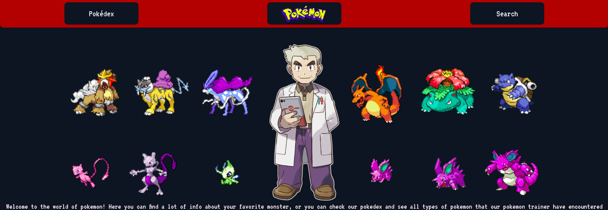

<!--
*** Template adatpet from: https://github.com/othneildrew/Best-README-Template
***
-->

<p align="center">
  <a href="https://github.com/cassiorodp/pokemon-world" target="_blank">
    
  </a>

  <h2 align="center">Pokedex App</h2>

  <p align="center">
    Online pokedex app to search for your favorite pokemons! powered by <a href="https://pokeapi.co" target="_blank">PokeAPI</a>.
    <br />
    <a href="https://cassiorodp.github.io/pokemon-world/" target="_blank">Source</a>
    ·
    <a href="https://github.com/cassiorodp/pokemon-world/issues" target="_blank">Report Bug</a>
  </p>
</p>

---



---

<details open="open">
  <summary><h2">Table of Contents</h2></summary>
  <ol>
    <li>
      <a href="#about">About</a>
      <ul>
        <li><a href="#features">Features</a></li>
        <li><a href="#techs">Techs</a></li>
      </ul>
    </li>
    <li>
      <span>Running the App</span>
      <ul>
        <li><a href="#prerequisites">Prerequisites</a></li>
        <li><a href="#installation">Installation</a></li>
      </ul>
    </li>
    <li><a href="#contribution">Contribution</a></li>
    <li><a href="#contacts">Contacts</a></li>
  </ol>
</details>

<h2 id="about">⚡ About</h2> 
<p align="center">
Pokemon World is an fan app for you to find your next favorite pokemon! Here you can find a lot of information about all pokemons, like his moves, types or even his evolutions!

This project was made with pair programming, so besides hard-skills, a lot of soft-skills where improved by making this app, eg: Communication, Colaboration and Creativity.

<h3 id="features">⚙ Features</h3>

- Search tool with animated feedback
- Complete pokedex with pagination
- Pokemon cards with animated css

<h3 id="techs">💻 Techs</h3>
  
<div>
   
  
  
   
</div>

<h3>👨‍💻 Running the App</h3>

To execute the app, please follow this instructions.

<h3 id="prerequisites">Prerequisites</h3>

You need to have these tools: NPM & Git.
Besides, if you want to contribuite later, it's good to have some code editor like vsCode

<h3 id="installation">Installation</h3>

1. Clone the repository (HTTPS or SSH)
   ```sh
   git clone https://github.com/cassiorodp/pokemon-world.git
   ```
    
   ```sh
   git@github.com:cassiorodp/pokemon-world.git
   ```

2. Acess the local repository and install the dependencies

   ```sh
   npm install
   ```
   
3. In the local repository, execute the following comand to run the app, by default it should run in `localhost:3000`, you can acess by your browser

   ```sh
   npm start
   ```

<h2 id="contribution">🏗 Contribution</h2>

Feel free to add any contribution on our app! Here is some instructions:
    
1. Fork
2. Create your feature/fix branch (`git checkout -b feature/fix`)
3. Commit your alterations (`git commit -m 'Improving your app!'`)
4. Push to remote repository (`git push origin feature/fix`)
5. Open a PR(Pull Request)

---

<h2 id="contacts">📫 Contacts</h2>
    
<h3>This project was done by the developers:</h3>
<ul>
    <li>
      <a href="https://www.linkedin.com/in/cassio-rodrigues-pereira/" target="_blank">
        
      </a>
      <a href="https://github.com/cassiorodp" target="_blank">
        
      </a>
    </li>
    <li>
      <a href="https://www.linkedin.com/in/murilo-rainho/" target="_blank">
        
      </a>
      <a href="https://github.com/Murilo-Rainho" target="_blank">
        
      </a>
    </li>
</ul>

---

[Find your favorite pokemon here!](https://cassiorodp.github.io/pokemon-world/)
We are open for feedbacks.
